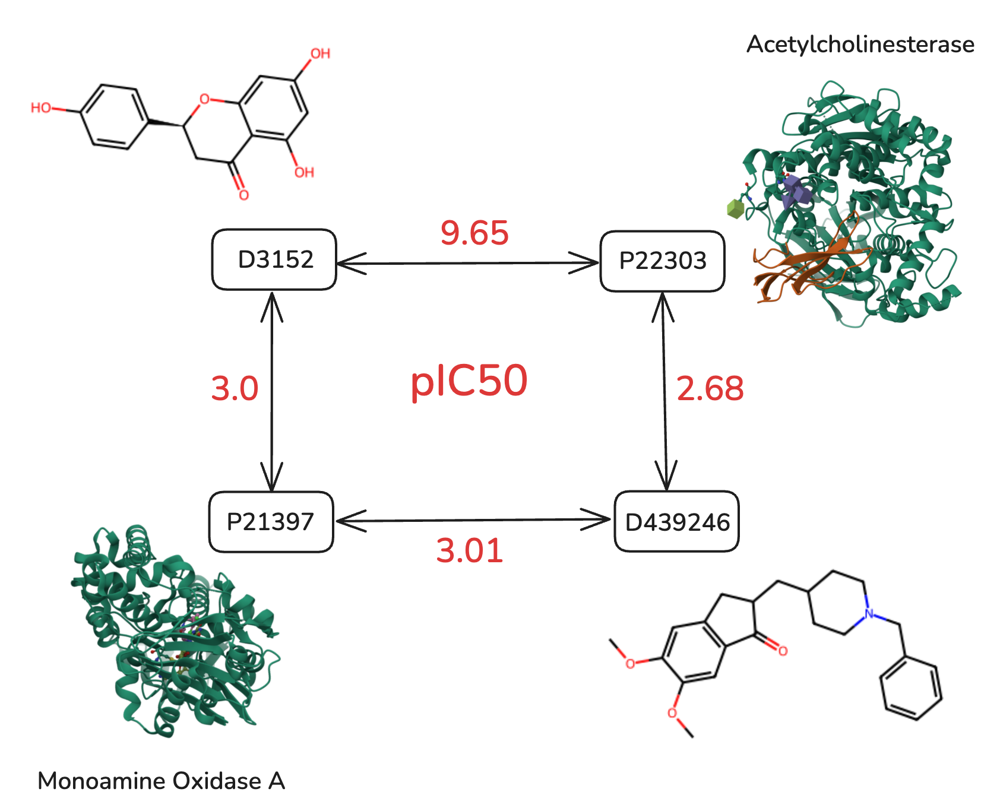
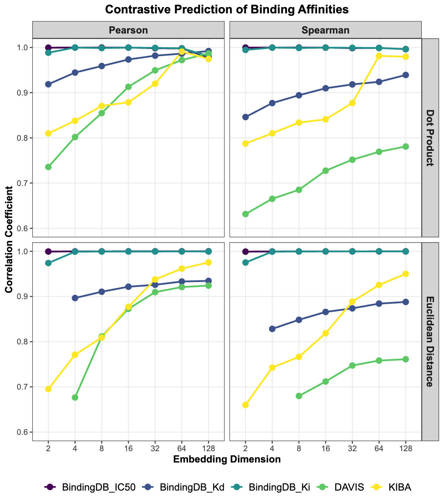

# Performance Bounds for Joint Embedding Models in Drug-Target Interaction Prediction

This repository contains the code and data for analyzing fundamental performance limits of contrastive drug-target interaction (DTI) models. The work demonstrates that binding affinities in standard benchmarks systematically violate basic metric axioms, establishing theoretical upper bounds on achievable performance.

## Overview

Joint embedding models like ConPlex, Drug CLIP, and SPRINT embed ligands and proteins in shared vector spaces, scoring interactions via geometric proximity. However, our analysis reveals that benchmark datasets (BindingDB, KIBA, DAVIS) contain systematic violations of metric axioms such as the triangle inequality. This creates fundamental performance ceilings that no contrastive model can exceed, regardless of architectural sophistication.


### Key Findings

- **Metric violations**: Binding affinities in benchmark datasets violate basic metric axioms
- **Performance bounds**: Even perfect optimization faces dataset-dependent performance ceilings
- **Dimensionality effects**: Higher dimensions relax these constraints significantly
- **Three behavioral regimes**: Metric-friendly, dimensionality-limited, and geometry-limited datasets

## Installation

```bash
# Clone the repository
git clone https://github.com/your-username/dti-bounds.git
cd dti-bounds

# Install dependencies
pip install -r requirements.txt

# Optional: Install in development mode
pip install -e .
```

### Requirements

- Python 3.8+
- PyTorch (GPU recommended for large datasets)
- See `requirements.txt` for complete dependencies

## Repository Structure

After running the reorganization script:

```
dti-bounds/
├── src/
│   ├── data/                   # Data downloading and preprocessing
│   │   └── download_datasets.py
│   ├── analysis/               # Metric violation analysis
│   │   └── triangle_inequality.py
│   ├── experiments/            # MDS implementations
│   │   ├── dot_product_mds.py  # Dot-product similarity MDS
│   │   └── euclidean_smacof.py # Euclidean distance MDS (SMACOF)
│   └── utils/                  # Utility functions
├── scripts/                    # Experiment runners
│   ├── run_dot_experiments.py
│   └── run_euclidean_experiments.py
├── data/                       # Data storage
│   ├── datasets/              # Downloaded datasets
│   └── violations/            # Triangle inequality violations
└── results/                   # Experimental results
```

## Usage
### Download Datasets

Download and preprocess the benchmark datasets:

```bash
python src/data/download_datasets.py
```

This downloads and processes:
- BindingDB (IC50, Kd, Ki)
- DAVIS
- KIBA

### Analyze Metric Violations

Find triangle inequality violations in the datasets:

```bash
python src/analysis/triangle_inequality.py data/datasets/BindingDB_IC50/sample.csv --output data/violations/BindingDB_IC50.csv
```



### Compute Performance Bounds


#### Dot Product Models (ConPlex, Drug CLIP style)

For single experiment:
```bash
python src/experiments/dot_product_mds.py \
    -i data/datasets/DAVIS/sample.csv \
    -o results/dot/DAVIS_dim64 \
    --dim 64 \
    -e 3000 \
    --lr 0.1
```

For comprehensive experiments across all datasets and dimensions:
```bash
python scripts/run_dot_experiments.py
```

#### Euclidean Distance Models (SMACOF)

For single experiment:
```bash
python src/experiments/euclidean_smacof.py \
    -i data/datasets/DAVIS/sample.csv \
    -o results/euclidean/DAVIS_dim64 \
    --dim 64 \
    -m 300
```

For comprehensive experiments:
```bash
python scripts/run_euclidean_experiments.py
```



## Key Scripts

### [`src/experiments/dot_product_mds.py`](src/experiments/dot_product_mds.py)
GPU-accelerated dot-product similarity optimization with SGD. Minimizes squared reconstruction error for inner-product models.

### [`src/experiments/euclidean_smacof.py`](src/experiments/euclidean_smacof.py)
SMACOF (Stress Majorization) implementation for Euclidean distance embeddings. Uses chunked GPU operations for memory efficiency.

### [`src/analysis/triangle_inequality.py`](src/analysis/triangle_inequality.py)
Identifies 2×2 bicliques where rectangular inequality violations occur, proving non-embeddability in metric spaces.


### Output Files

Each experiment produces:
- `embeddings.pt`: Full embedding tensor
- `drug_embeddings.pt`: Drug embeddings only
- `target_embeddings.pt`: Target embeddings only
- `*_mapping.csv`: ID to index mappings
- `metrics.json`: Performance metrics and parameters

## Citation

If you use this code or data in your research, please cite:

```bibtex
@article{lzicar2025bounds,
  title={Performance Bounds for Joint Embedding Models in Drug-Target Interaction Prediction},
  author={Lžičař, Miroslav},
  journal={Preprint},
  year={2025}
}
```

## License

This project is licensed under the MIT License - see the LICENSE file for details.